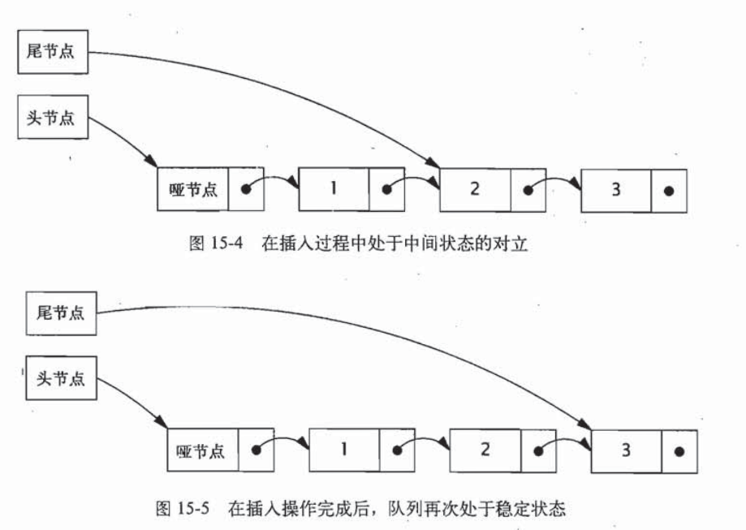

### 原子操作与非阻塞同步机制

非阻塞算法主要使用低层的机器指令代替锁来确保数据在并发访问中的一致性，非阻塞算法被广泛用在操作系统，JVM等中实现线程，进程调度等。非阻塞算法不存在死锁和其他活跃性问题。

java5之后可以使用原子变量类来实现高效的非阻塞算法

#### 锁的劣势

挂起与回复线程具有较大的开销，volatile不能够用于实现一些复合的原子操作，在等待锁时，不能够做任何事，当持有锁的线程被调度而延迟执行，而又有另外的线程抢到优先执行的，那么会造成死锁。

#### 硬件对并发的支持

独占锁要求任何时候最多仅允许一个线程占据资源，而乐观锁，则通过冲突检查机制，检查更新过程中是否有其他线程的干扰，如果有，那么操作将会失败。

##### CAS：比较并交换

该操作的含义：CAS（V，A，B），当V的值等于A时，才会通过原子方式用B更新V的值，否则不会执行任何操作。无论位置V的值是否等于A，都将返回V原来的值。

##### 非阻塞的计数器

CAS失败时会不断重试

#### 原子变量类

原子变量类相当于一种泛化的volatile变量，能够支持原子的和有条件的读-该-写操作。

#### 非阻塞算法

如果在某种算法中，一个线程的失败或者挂起不会导致其他线程的挂起或者失败，那么称这种算法为非阻塞的。如果在算法中的步骤都存在某个线程能够执行，那么又称之为无锁算法。

##### 非阻塞的栈

创建非阻塞的算法要求将原子修改的范围缩小到单个变量上，同时还要维护数据的一致性。

##### 非阻塞的链表

```java
public class LinkedQueue <E> {

    private static class Node <E> {
        final E item;
        final AtomicReference<Node<E>> next;

        public Node(E item, LinkedQueue.Node<E> next) {
            this.item = item;
            this.next = new AtomicReference<LinkedQueue.Node<E>>(next);
        }
    }

    private final LinkedQueue.Node<E> dummy = new LinkedQueue.Node<E>(null, null);
    private final AtomicReference<LinkedQueue.Node<E>> head
            = new AtomicReference<LinkedQueue.Node<E>>(dummy);
    private final AtomicReference<LinkedQueue.Node<E>> tail
            = new AtomicReference<LinkedQueue.Node<E>>(dummy);

    public boolean put(E item) {
        LinkedQueue.Node<E> newNode = new LinkedQueue.Node<E>(item, null);
        while (true) {
            LinkedQueue.Node<E> curTail = tail.get();
            LinkedQueue.Node<E> tailNext = curTail.next.get();
            if (curTail == tail.get()) {//这里是必须的，为了防止其他的线程刚刚好修改好tail，造成curtail变成过期数据。
                if (tailNext != null) {
                    // 队列处于中间状态，推进尾节点，在末尾插入了节点，但是还没有推进尾节点，也就是执行到下面一个if语句就被挂起或者阻塞了
                    tail.compareAndSet(curTail, tailNext);
                } else {
                    // 处于稳定状态，尝试插入新节点
                    if (curTail.next.compareAndSet(null, newNode)) {
                        // 插入操作成功，尝试推进尾节点
                        tail.compareAndSet(curTail, newNode);
                        return true;
                    }
                }
            }
        }
    }
}
```



上述代码各部分的解析见代码中的注释

##### 原子域更新器

实际的ConcurrentLinkedQueue中没有使用上面的原子引用来表示节点，而是使用了volatile类型引用，并基于反射的AtomicReferenceFieldUpdater来进行更新。

```java
private class Node<E>{
    private final E item;
    private volatile Node<E> next;
    
    public Node(E item){
        this.item = item;
    }
}

private static AtomicReferenceFieldUpdater<Node,Node> nextUpdater = 
    AtomicReferenceFieldUpdater.newUpdater(Node.class,Node.class,"next");
```

